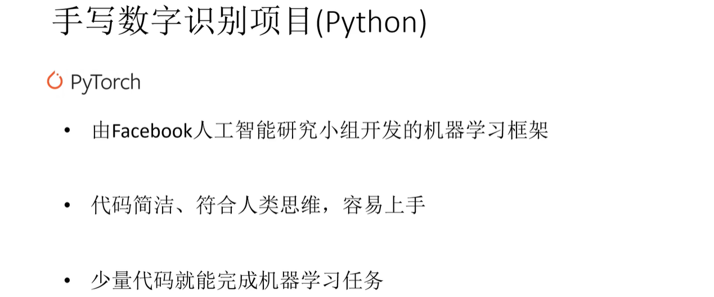
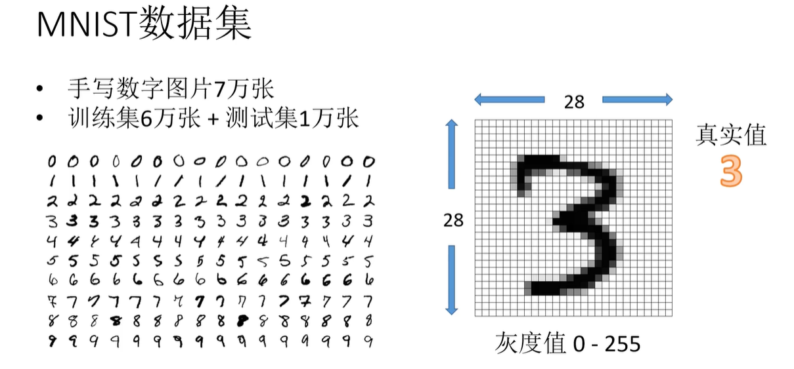
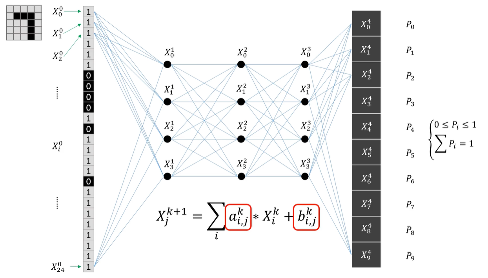
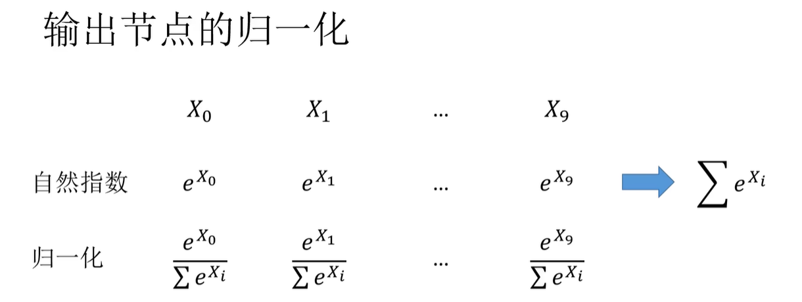
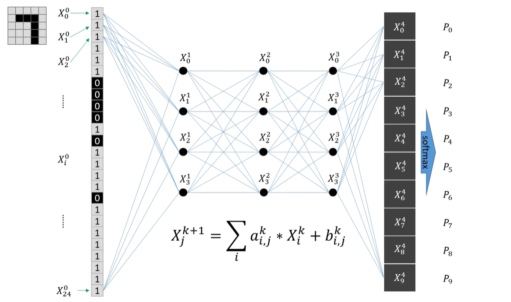
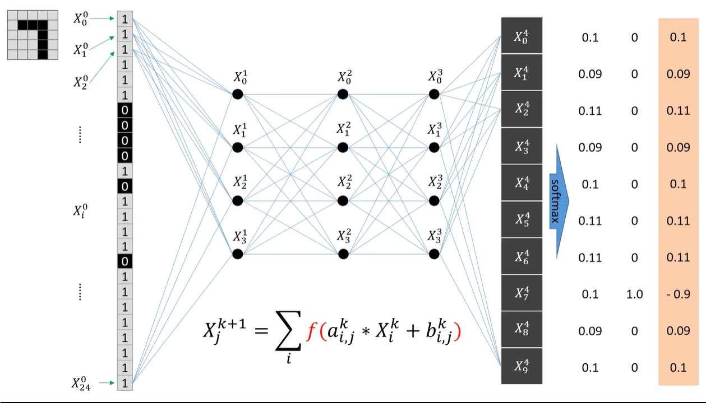
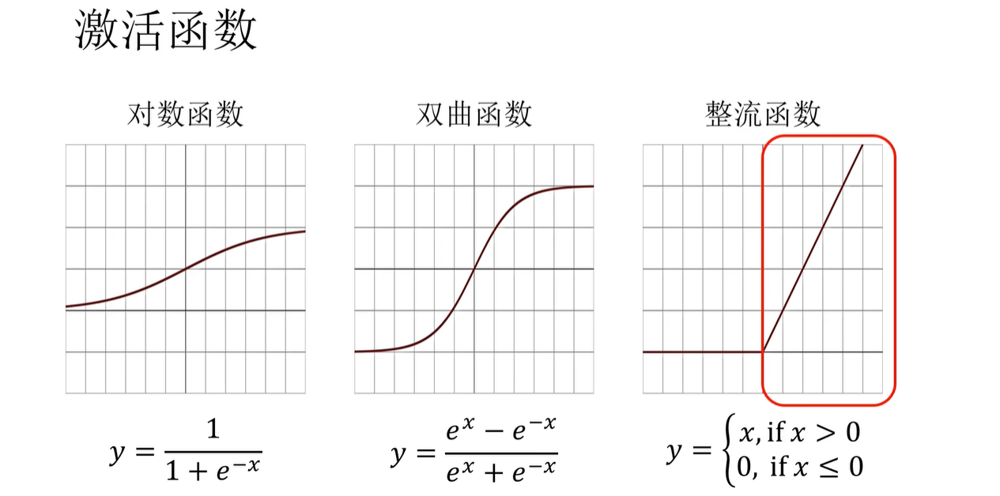
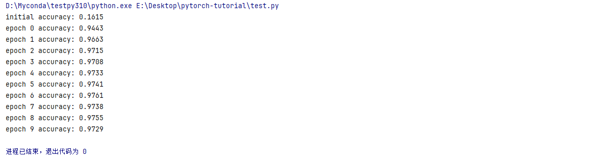
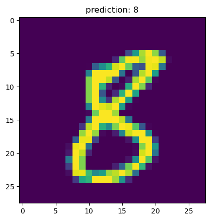
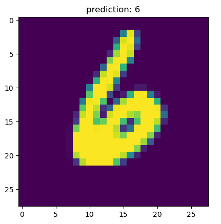

# 手写数字识别项目（Pytorch）

# MNIST数据集

# 输出节点的归一化

# 激活函数

# 过程描述

将图片拆分成一维像素阵列，输入到神经网络，通过节点间的计算公式图像信息传输到输出层，通过Softmax归一化，得到一个概率分布，再通过大量图像数据的训练，不断调整网络参数，让概率分布更接近真实值，故神经网络的本质就是一个数学函数，训练过程就是调整函数的参数。

# 环境配置

Python=3.10.14，其余配置文件

conda create -n HDR python==3.10.14

conda activate HDR

conda install pytorch== 2.4.0 torchvision==0.19.0 matplotlib==3.8.4

上述代码如果无法使用的话，则运行下列代码。

cd 自己本地的代码目录 （或者在本地代码目录的上方打开cmd）

pip install -r requirements.txt

# 实现结果

参考链接：https://www.bilibili.com/video/BV1GC4y15736/
